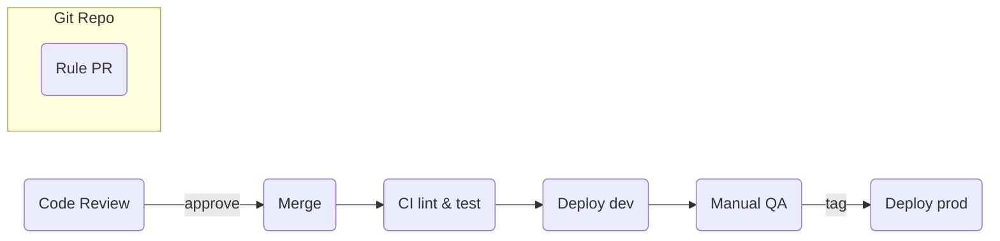
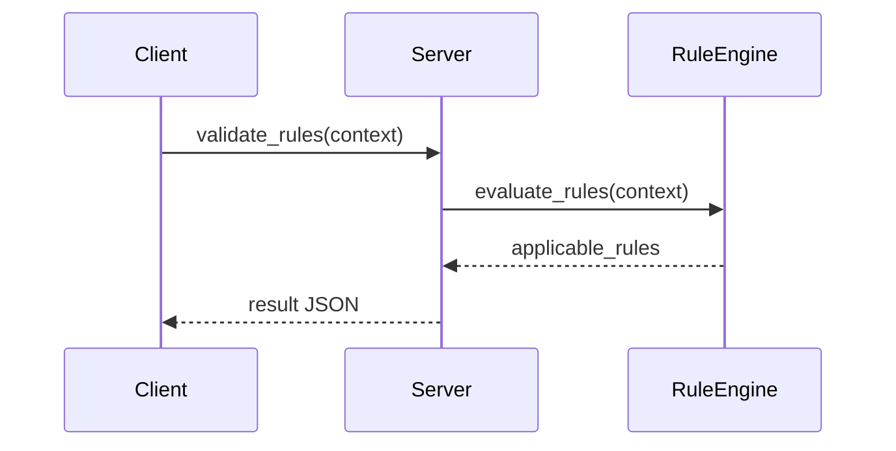

# LLM階層型ルール管理MCPサーバー

## 🎉 実装完了・動作確認済み

**✅ MCPサーバーの実装とClaude Code連携が完了しました！**

LLM アプリケーション向けに **グローバル／プロジェクト／個別** の階層ルールを一元管理し、動的に適用・検証可能な MCP サーバーを Python で構築しました。運用・ガバナンス・監査を包括し、**STDIO** をデフォルトに据えつつ **Streamable HTTP** への移行が容易な構成を提供します。

### 🚀 クイックスタート

```bash
# 1. 環境セットアップ
python3 -m venv venv && source venv/bin/activate
pip install -e .

# 2. Claude CodeへのMCP登録
claude mcp add rules_mcp -e PYTHONPATH=src -- /workspace/rules_mcp/venv/bin/python -m rule_manager.main

# 3. 動作確認
claude mcp list
# 出力: rules_mcp: /workspace/rules_mcp/venv/bin/python -m rule_manager.main
```

現在 **11個のサンプルルール** が登録済みで、**8つのMCPツール** が利用可能です。

詳細は **[docs/WORKING_STATUS.md](docs/WORKING_STATUS.md)** をご確認ください。

## 1. 概要

---

## 2. 技術スタック

| 項目      | 採用技術                                               | 備考                               |
| ------- | -------------------------------------------------- | -------------------------------- |
| 言語      | Python 3.11+                                       | poetry / pyproject.toml 管理       |
| フレームワーク | FastMCP 2.8.x+                                     | FastMCP Proxy 併用                 |
| 設定管理    | Pydantic v2 + pydantic‑settings                    | `.env` で上書き可                     |
| データ形式   | YAML 1.2                                           | ルール定義・設定ファイル                     |
| トランスポート | **STDIO** (★5)<br>Streamable HTTP (★4)<br>SSE (★2) | HTTP は `host` 無視バグ (#924) あり     |
| CI/CD   | GitHub Actions                                     | テスト / lint / docs / Docker build |

---

## 3. トランスポート戦略

### 3.1 推奨度

<details>
<summary>比較表</summary>

| 手段                  | 用途           | 推奨度   | 備考                    |
| ------------------- | ------------ | ----- | --------------------- |
| **STDIO**           | ローカル CLI・IDE | ★★★★★ | デフォルト                 |
| **Streamable HTTP** | リモート / Web   | ★★★★☆ | `async_mode=True` は β |
| **SSE** (legacy)    | 旧クライアント      | ★★☆☆☆ | 段階的廃止                 |

</details>

### 3.2 接続方針

* サーバーは **1 プロセス 1 トランスポート** を原則。複数同時公開は FastMCP Proxy でブリッジ。
* クライアント側の `transport="auto"` は `streamable-http → sse → stdio` でフォールバック。
* **高並列** (100 sessions) は `mcp.run(async_mode=True)` + プロセスワーカーで水平スケール。

---

## 4. 設定管理

```python
from pydantic_settings import BaseSettings, SettingsConfigDict

class ServerSettings(BaseSettings):
    model_config = SettingsConfigDict(
        env_prefix="FASTMCP_RULE_",
        env_file=".env",
        env_file_encoding="utf-8",
        case_sensitive=False,
        extra="ignore",
    )
    transport: Literal["stdio", "streamable-http", "sse"] = "stdio"
    host: str = "127.0.0.1"
    port: int = 8000
    rules_dir: str = "config/rules"

    # 旧プレフィックス互換
    def __init__(self, **data):
        if "MCP_RULE_TRANSPORT" in os.environ:
            os.environ["FASTMCP_RULE_TRANSPORT"] = os.environ["MCP_RULE_TRANSPORT"]
        super().__init__(**data)
```

* `.env` は UTF‑8。CLI `--env-file` で優先。

---

## 5. ルールエンジン & DSL

### 5.1 ルールモデル

```python
class Rule(BaseModel):
    name: str
    scope: RuleScope
    priority: int = Field(ge=0, le=100)
    conditions: Dict[str, Any] = {}
    action: RuleAction
    parameters: Dict[str, Any] = {}
    parent_rule: Optional[str] = None
    inherits_from: Optional[List[str]] = None

    model_config = ConfigDict(extra="forbid")
```

* 循環継承は起動時に検出しエラー。

### 5.2 条件 DSL の安全評価

* **禁止**: `eval`, `exec`, `ast.literal_eval`
* **採用**: `filtrex`（初期） ➜ 複雑化時に ANTLR パーサへ移行。

### 5.3 優先度競合解決

| アルゴリズム | デフォルト | CLI 切替                 |
| ------ | ----- | ---------------------- |
| FIFO   | ●     | `--priority-tie=fifo`  |
| 名前昇順   |       | `--priority-tie=lexi`  |
| 先勝ち    |       | `--priority-tie=first` |

### 5.4 バージョニング

```yaml
ruleset_version: "1.1"
engine_min_version: ">=2.8.0"
```

* `RuleEngine` は `semver` 判定で拒否 / 警告。

### 5.5 ホットリロード

* YAML: `watchdog` でファイル監視。<br>\* DB: `NOTIFY` / Keyspace events で PubSub。

---

## 6. ストレージ & 排他制御

### 6.1 抽象インターフェース

```python
class RuleStore(ABC):
    async def load_rules(self, scope: RuleScope) -> RuleSet: ...
    async def save_rules(self, ruleset: RuleSet): ...
```

### 6.2 実装と排他

| 実装     | 同期    | 排他          | 備考      |
| ------ | ----- | ----------- | ------- |
| YAML   | sync  | portalocker | 小規模向け   |
| SQLite | async | WAL Tx      | 単一ホスト向け |
| Redis  | async | Lua Tx      | 高速・分散   |

---

## 7. セキュリティ

### 7.1 認証 & 権限

* Bearer JWT (`scope`, `permissions`)
* `rules:read`, `rules:write`, `rules:admin` の 3 段階

### 7.2 監査ログ

* SQLite Append‑only + SHA‑256 チェックサム
* `structlog` で JSON 出力

### 7.3 Rate‑Limiting

* nginx / Caddy 推奨。fallback: `slowapi` + redis counter

### 7.4 脅威モデル（STRIDE 抜粋）

| 分類                         | シナリオ              | 対策                             |
| -------------------------- | ----------------- | ------------------------------ |
| **Tampering**              | ルール YAML 改ざん      | 監査ログ + checksum + JWT scope 制御 |
| **Repudiation**            | 操作者不明             | who/when ログ + 時刻署名             |
| **Elevation of Privilege** | 無権限 manage\_rules | JWT scope & RBAC               |

---

## 8. 観測性

* **構造化ログ**: `structlog`, JSON
* **メトリクス**: Prometheus `/metrics`
* **トレース**: OpenTelemetry `traceparent` ヘッダ (STDIO 拡張)

---

## 9. テスト & CI

| レイヤ    | ツール                     | 目標                     |
| ------ | ----------------------- | ---------------------- |
| 単体     | pytest + InMemoryClient | カバレッジ 90%              |
| 負荷     | locust                  | 100 並列 < 100 ms        |
| 移行     | pytest‑e2e              | YAML→SQLite / SSE→HTTP |
| セキュリティ | bandit / trivy          | High Severity 0        |

---

## 10. 運用フロー & ロールバック

### 10.1 ルール運用



* 失敗時は `rollback.sh --tag <prev>` で Docker image を即時切替。

### 10.2 ロールバック手順

1. `kubectl rollout undo deployment/rule-manager`
2. `rule_manager.migrate --to prev --dry-run`
3. Prometheus アラート OK を確認

---

## 11. パフォーマンス & 容量試算

| 指標        | 目標             | 備考                  |
| --------- | -------------- | ------------------- |
| ルール評価応答   | < 100 ms (p95) | 100 並列              |
| メモリ消費     | < 256 MB       | YAML + cache 1k ルール |
| Disk IOPS | < 500          | SQLite WAL          |

---

## 12. 依存ライブラリ & ライセンス

* **依存固定**: `poetry.lock` で minor‑pin。GitHub Dependabot 有効。
* **脆弱性監査**: CI で `pip-audit`。
* **ライセンス**: Apache‑2.0 予定。
* **コード規約**: black / ruff / mypy pre‑commit。

---

## 13. 互換 & サポートマトリクス

| コンポーネント       | バージョン  | サポート状態 |
| ------------- | ------ | ------ |
| FastMCP 2.8.x | 正式サポート | ✔      |
| FastMCP 2.9.x | 技術検証   | △      |
| FastMCP ≤2.7  | 非対応    | ×      |
| Python 3.11   | 正式     | ✔      |
| Python 3.12   | 準公式    | △      |

---

## 14. エラーハンドリング仕様

| コード    | HTTP status / STDIO tag | 再試行 | 説明            |
| ------ | ----------------------- | --- | ------------- |
| `E001` | 400                     | ×   | ルール DSL 構文エラー |
| `E101` | 409                     | △   | 優先度競合解決不能     |
| `E201` | 423                     | ○   | YAML 排他ロック失敗  |
| `E500` | 500                     | △   | 予期せぬ例外        |

---

## 15. アーキテクチャ図

### 15.1 ブロック図

```ascii
+---------------------+
|  Client (IDE/CLI)   |
+---------+-----------+
          |  STDIO / HTTP / SSE
+---------v-----------+
|  FastMCP Proxy      |
+---------+-----------+
          |  STDIO (internal)
+---------v-----------+
| Rule Manager Server |
|  + RuleEngine       |
|  + RuleStore (plg) |
+---------+-----------+
          |
+---------v-----------+
|  Storage (YAML/DB)  |
+---------------------+
```

### 15.2 ルール評価シーケンス



---

## 16. Appendix

* Glossary
* Changelog

---

© 2025 Your Org. Apache‑2.0 license.
